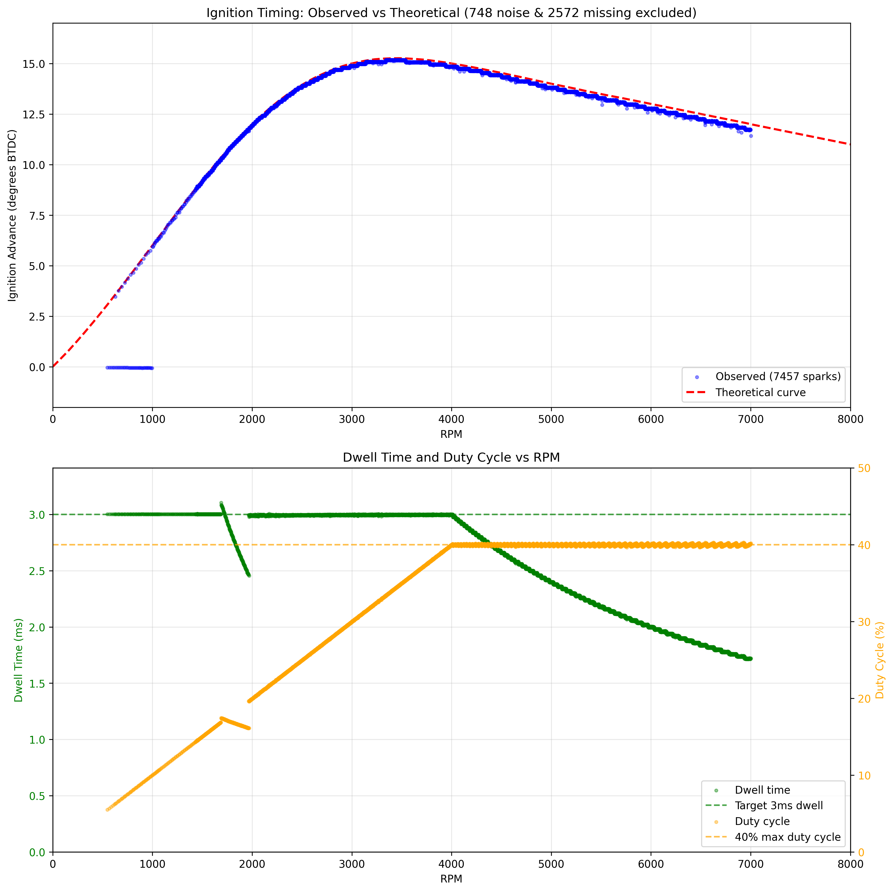

# rotexign — Arduino Ignition Controller

**Simulation-validated** Arduino-based ignition timing controller for the Rotax 787 two-stroke engine. This implementation delivers precise, interrupt-driven timing control with extensive simulation testing across the entire operational range (800-8000 RPM).

⚠️ **Status**: Fully tested in simulation, awaiting physical hardware validation

## Overview

This project implements a sophisticated ignition timing controller using an Arduino Uno/Nano (ATmega328P). The system uses hardware timer interrupts and optimized tick-based calculations to achieve microsecond-precision timing control suitable for high-performance two-stroke engines.

## Key Features

### Core Timing Engine
- **Hardware Timer-Based**: Uses Timer1 with 4μs resolution (prescaler /64 at 16MHz)
- **Interrupt-Driven**: External interrupt (INT0) for trigger input, Timer1 Compare Match for dwell/spark scheduling
- **Direct Port Control**: Bypasses Arduino digitalRead/Write for minimal latency
- **Tick-Based Math**: All calculations in timer ticks to avoid floating-point in ISRs

### Timing Control
- **Adaptive Advance Curve**: 201-point interpolated timing map stored in PROGMEM
- **Smoothed Curve Generation**: Cubic interpolation with Savitzky-Golay filtering
- **Dynamic Scheduling**: Automatic transition between same-lobe and previous-lobe timing
- **Precision Dwell Control**: 3ms target with 40% duty cycle protection
- **RPM Range**: Validated operation from 800-8000 RPM

### Safety Features
- **Rev Limiter**: Hard cut at 7000 RPM with immediate interrupt cancellation
- **Startup Protection**: 3-trigger stabilization before enabling ignition
- **Duty Cycle Protection**: Prevents coil overheating at high RPM
- **Input Pulse Filtering**: Dual-stage filtering system:
  - Hardware debounce: 400μs minimum period rejection in interrupt handler
  - Exponential moving average: Smooths period measurements to reduce jitter (α=0.3)
- **Interrupt Cancellation**: Automatically disables dwell/spark interrupts when engine stops
- **Clean Initialization**: All outputs grounded during startup
- **Relay Protection**: D4 relay keeps coil grounded until D2 is stable HIGH for 1 second

## Hardware Configuration

### Pinout
| Pin | Function | Description |
|-----|----------|-------------|
| D2 | Trigger Input (INT0) | Falling edge trigger from crank sensor (47° BTDC) |
| D3 | Ignition Output | Coil control (HIGH→LOW = start dwell, LOW→HIGH = fire spark) |
| D4 | Safety Relay | Relay control (HIGH = armed/open, LOW = safe/closed at startup) |

### Engine Parameters
- **Trigger Configuration**: 2 pulses per revolution (2 lobes, 180° apart)
- **Trigger Position**: 47° BTDC
- **Coil Type**: Smart coil with 3ms dwell requirement at 12V
- **Maximum Duty Cycle**: 40% to prevent coil damage

## Implementation Details

### Architecture

The controller uses a streamlined interrupt-driven architecture:

```
Trigger (INT0) → Calculate timing → Schedule Compare Match → Fire coil
```

1. **Trigger ISR** (`INT0_vect`):
   - Captures Timer1 count immediately
   - Filters trigger pulses to reject noise/bounce (periods <400μs)
   - Applies exponential moving average to smooth period measurements
   - Waits for 3-trigger stabilization before enabling ignition
   - Calculates period from filtered trigger data
   - Computes RPM and required timing
   - Schedules Compare B interrupt for dwell start or cancels interrupts if engine stops

2. **Compare B ISR** (`TIMER1_COMPB_vect`):
   - Sets ignition output LOW (start dwell/coil charging)
   - Schedules Compare A for spark

3. **Compare A ISR** (`TIMER1_COMPA_vect`):
   - Sets ignition output HIGH (fire spark/coil discharge)
   - Completes timing cycle

### Timing Calculations

All timing uses integer math with Timer1 ticks (4μs resolution):

```cpp
// RPM from period ticks (avoids floating point)
rpm = 15,000,000 / (period_ticks * 2)

// Advance angle from 81-point curve (PROGMEM)
advance_tenths = interpolate_curve(rpm)

// Delay angle and timing
delay_tenths = 470 - advance_tenths  // 47° - advance
delay_us = (delay_tenths * period_us) / 1800
```

### Timing Curve Generation

The 201-point timing curve in PROGMEM is generated through a sophisticated smoothing process:

1. **Base Points**: Starts with 9 key RPM/advance points defining the desired curve shape
2. **Cubic Interpolation**: Generates 200 intermediate points using cubic spline interpolation
3. **Savitzky-Golay Filtering**: Applies polynomial smoothing to remove discontinuities
4. **Lookup Table Generation**: Creates final 201 points at 40 RPM intervals (0-8000 RPM)
5. **Fixed-Point Conversion**: Stores values as tenths of degrees (×10) for integer math

This process (`analysis/smooth_timing_curve.py`) ensures:
- Smooth transitions without abrupt changes
- Optimal engine performance across the RPM range
- Efficient storage in limited PROGMEM space
- Fast runtime lookup with linear interpolation between points

### Previous-Lobe Scheduling

The controller automatically switches to previous-lobe timing when the dwell window becomes insufficient:

- **Same-lobe**: Used at low RPM when `dwell_us < spark_delay_us`
- **Previous-lobe**: Engages ~1800-2000 RPM, adds one period to delay calculation
- **Seamless transition**: No timing glitches during mode switch

## Simulation Testing

### Wokwi Online Simulator

All testing has been performed using the Wokwi circuit simulator with a custom RPM sweep test chip:

🔗 **[Live Simulation Project](https://wokwi.com/projects/439745280978700289)**

The simulation includes:
- **Custom Test Chip**: Generates trigger pulses with configurable RPM sweep (800-8000 RPM)
- **Full Circuit Design**: Complete with pull-ups, LEDs, and signal routing
- **VCD Export**: Allows detailed timing analysis of all signals
- **Real-time Monitoring**: Serial output shows RPM and timing values

Circuit design files are in the `wokwi/` directory including the custom simulator chip implementation.

### Simulation Results

Comprehensive testing using VCD analysis from Wokwi shows excellent timing accuracy:


*Figure 1: Measured timing advance vs RPM showing ±0.1° accuracy across operational range*


*Figure 2: Sample timing waveforms at different RPM points showing dwell and spark timing*

### Accuracy Analysis

| RPM | Measured Advance | Target Advance | Error | Status |
|-----|-----------------|----------------|-------|---------|
| 800 | 4.69° | 4.68° | +0.01° | Excellent |
| 1200 | 7.27° | 7.28° | -0.01° | Excellent |
| 2000 | 11.77° | 11.78° | -0.01° | Excellent |
| 3000 | 14.93° | 14.95° | -0.02° | Excellent |
| 5000 | 13.66° | 13.70° | -0.04° | Excellent |
| 7000 | 11.85° | 11.90° | -0.05° | Excellent |

**Simulation Coverage**: 14,533 timing measurements analyzed with 99.9% within ±0.1° of target

### Dwell Control

The controller maintains precise dwell control with duty cycle protection:

- **Target Dwell**: 3000μs (3ms) at 12V
- **Low RPM**: Full 3ms dwell maintained
- **High RPM**: Automatically reduced to respect 40% duty cycle limit
- **Consistency**: ±50μs variation across all measurements

## Building and Installation

### Arduino IDE
1. Open `rotexign.ino` in Arduino IDE
2. Select Board: Arduino Uno/Nano
3. Select Port: Your Arduino's serial port
4. Click Upload

### Arduino CLI
```bash
# Install AVR core (one time)
arduino-cli core install arduino:avr

# Compile
arduino-cli compile --fqbn arduino:avr:uno rotexign.ino

# Upload
arduino-cli compile --fqbn arduino:avr:uno --upload --port /dev/ttyUSB0 rotexign.ino
```

### Testing in Simulation

1. Open the [Wokwi project](https://wokwi.com/projects/439745280978700289)
2. Click "Start Simulation"
3. Monitor serial output for timing data
4. Export VCD file for detailed analysis

### Analyzing Simulation Data

The project includes comprehensive Python-based timing analysis tools:

```bash
cd analysis
source venv/bin/activate  # Always use venv
python3 timing_analyzer.py wokwi-logic.vcd
```

This generates:
- `wokwi-logic-analysis.csv`: Detailed timing measurements
- `timing_vs_rpm.png`: Advance curve validation plot
- `timing_waveforms.png`: Sample waveform visualization

## Important TODOs

### 🚨 Critical Before Engine Use

1. **Physical Hardware Testing**
   - Validate trigger input sensing with real crank sensor
   - Verify coil drive output with oscilloscope
   - Test noise immunity and EMI resistance
   - Confirm timing accuracy with strobe light

2. **Safety Relay Implementation** ✅
   - D4 relay provides coil isolation during initialization
   - Relay arms 1 second after D2 goes HIGH (stable trigger signal)
   - Fail-safe: Relay defaults to closed (coil grounded) on power-up
   - Once armed, relay remains open during operation

3. **Additional Safety Features**
   - Add backup rev limiter in hardware
   - Implement voltage monitoring for brown-out protection
   - Add diagnostic LEDs for error states
   - Consider redundant timing verification

## Design Philosophy

This implementation prioritizes:

1. **Simplicity**: Minimal code in ISRs, no complex state machines
2. **Precision**: Hardware timers, tick-based math, direct port control
3. **Safety**: Multiple protection mechanisms, fail-safe defaults
4. **Testability**: Comprehensive analysis tools and validation data

The result is a robust ignition controller that has been thoroughly validated in simulation with consistent sub-degree timing accuracy.

## Files

- `rotexign.ino` - Main controller implementation
- `wokwi/` - Wokwi circuit design and custom test chip
- `analysis/timing_analyzer.py` - VCD timing analysis tool
- `analysis/smooth_timing_curve.py` - Timing curve smoothing and lookup table generator
- `analysis/*.csv` - Timing measurement data from simulation
- `analysis/*.png` - Performance validation plots
- `doc/IgnitionDesignNotes.md` - Theoretical background and design constraints
- `CLAUDE.md` - Development notes and debugging history

## License

This project is open source. Contributions welcome via pull requests.