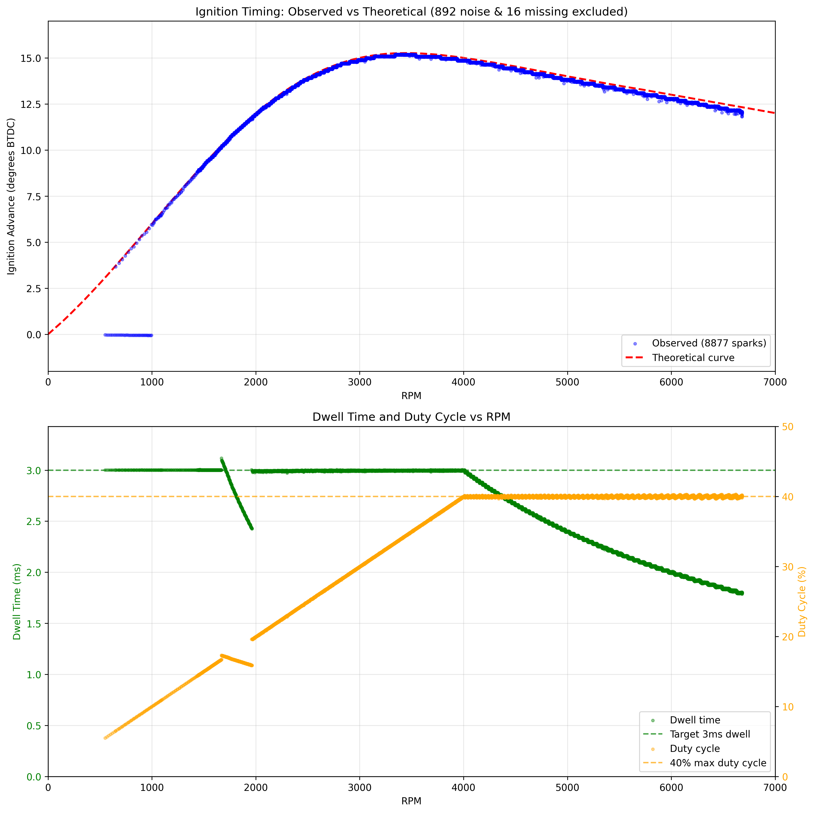
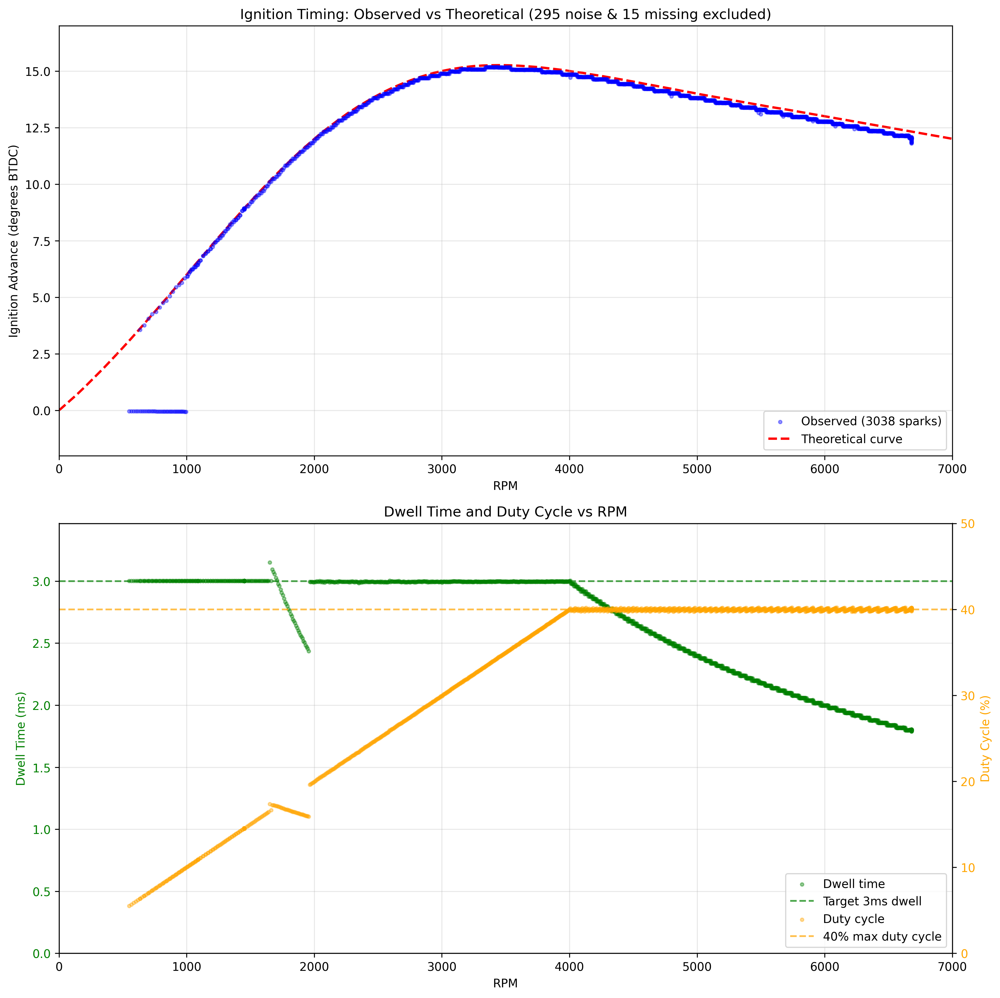

# rotexign — Arduino Ignition Controller

Arduino-based ignition timing controller for the Rotax 787 two-stroke engine. This implementation uses interrupt-driven timing control with a deferred processing architecture for precise dwell and spark scheduling.

✅ **Status**: Production-ready ignition controller with advanced RPM prediction and dual timing system

## Overview

This project implements a sophisticated ignition timing controller using an Arduino Uno/Nano (ATmega328P). The system uses hardware timer interrupts and optimized tick-based calculations to achieve microsecond-precision timing control suitable for high-performance two-stroke engines.

## Key Features

### Core Timing Engine
- **Hardware Timer-Based**: Uses Timer1 with 0.5μs resolution (prescaler /8 at 16MHz)
- **Direct Port Control**: Bypasses Arduino digitalRead/Write for minimal latency
- **Interrupt-Driven**: External interrupt (INT0) captures timing with microsecond precision
- **Ring Buffer**: Buffered event system for reliable trigger processing

### Advanced RPM Prediction System
- **Holt's Double Exponential Smoothing**: Predicts next-cycle RPM using floating-point precision
- **Dual Timing Calculations**: Current RPM (measured) + Predicted RPM (next cycle)
- **Linear Prediction**: Predicts RPM changes (linear) rather than period (non-linear) for better accuracy
- **Real-Time Correction**: Secondary spark adjustment during dwell phase for maximum precision

### Timing Control  
- **Adaptive Advance Curve**: 201-point interpolated timing map stored in PROGMEM
- **Previous-Lobe Timing**: Always uses previous lobe for timing (one full period delay)  
- **Precision Dwell Control**: 3ms target with 40% duty cycle protection
- **Two-Stage Scheduling**: Separate dwell start and spark fire events with real-time adjustment
- **RPM Range**: Designed for 800-8000 RPM operation

### Safety Features
- **Rev Limiter**: Hard cut at 7000 RPM with immediate ignition disable
- **Startup Protection**: 3-trigger stabilization before enabling ignition
- **Duty Cycle Protection**: Prevents coil overheating at high RPM
- **Input Pulse Filtering**: 30% period change rejection with noise immunity system
- **Relay Protection**: D4 relay keeps coil grounded until D2 is stable HIGH for 1 second
- **Clean Initialization**: All outputs start in safe state

## Hardware Configuration

### Pinout
| Pin | Function | Description |
|-----|----------|-------------|
| D2 | Trigger Input (INT0) | Falling edge trigger from crank sensor (47° BTDC) |
| D3 | Ignition Output | Coil control (HIGH→LOW = start dwell, LOW→HIGH = fire spark) |
| D4 | Safety Relay | Relay control (HIGH = armed/open, LOW = safe/closed at startup) |

### Engine Parameters
- **Trigger Configuration**: 2 pulses per revolution (2 lobes, 180° apart)
- **Trigger Position**: 47° BTDC
- **Coil Type**: Smart coil with 3ms dwell requirement at 12V
- **Maximum Duty Cycle**: 40% to prevent coil damage

## Implementation Details

### Advanced Dual-Timing Architecture

The controller implements a sophisticated prediction system with real-time corrections:

```
Trigger (INT0) → RPM Prediction → Dual Timing → Schedule Dwell → Dynamic Spark Adjustment
```

1. **Trigger ISR** (`INT0_vect`):
   - Captures Timer1 count immediately for precise timing  
   - Filters trigger pulses to reject 30% period changes (noise rejection)
   - Calculates current RPM from measured period
   - Updates Holt's Method predictor with current RPM
   - Schedules dwell start using predicted timing

2. **RPM Prediction System** (`holt_update_and_predict()`):
   - **Holt's Double Exponential Smoothing**: α=0.4 (level), β=0.1 (trend)
   - **Floating-Point Precision**: Clean implementation without integer scaling artifacts
   - **RPM-Based Prediction**: Predicts linear RPM changes rather than non-linear period changes
   - **Fast Convergence**: 2-sample initialization for rapid startup

3. **Dual Timing Calculations**:
   - **Current Timing**: Based on measured RPM from last trigger (`advance_tenths_0`, `spark_delay_ticks_0`)
   - **Predicted Timing**: Based on predicted next-cycle RPM (`advance_tenths_1`, `spark_delay_ticks_1`) 
   - **Dynamic Selection**: Uses current timing for dwell scheduling, predicted timing for spark adjustment
   - **Instant Dwell Mode**: Automatically triggered at high RPM when dwell must start immediately

4. **Timer1 Compare Interrupts**:
   - **Compare A ISR**: Starts dwell (LOW), schedules spark using current timing
   - **Compare B ISR**: Fires spark (HIGH), can be dynamically adjusted during dwell
   - **Real-Time Adjustment**: If already dwelling, updates spark timing to predicted values

### Noise Filtering System

The controller implements dual-layer noise immunity to ensure reliable operation in electrically noisy environments:

```cpp
// Layer 1: Hardware noise filtering (30% period change rejection)
uint16_t period_delta = abs(period_ticks - Timing::previous_period);
uint16_t period_threshold = Timing::previous_period * 3 / 10;  // 30% threshold

if (period_delta > period_threshold && Timing::previous_period > 0) {
    Timing::filtered_triggers++;  // Count filtered events
    return;  // Reject noisy trigger, maintain previous timing
}
```

**Layer 1 - Hardware Filtering**:
- **30% Period Change Rejection**: Triggers with >30% period variation are immediately rejected
- **Maintains Previous Timing**: Filtered triggers don't update RPM calculations or timing
- **Noise Counter**: Tracks filtered events for diagnostics
- **Real-Time Operation**: Filtering occurs in ISR for zero-latency protection

**Layer 2 - Holt's Method Smoothing**:
- **Trend-Aware Filtering**: Double exponential smoothing inherently filters measurement noise
- **Preserves Acceleration**: Unlike simple averaging, maintains sensitivity to genuine RPM changes
- **Statistical Robustness**: α=0.4, β=0.1 parameters balance noise rejection with responsiveness

**Simulation Integration**:
The Wokwi pulse simulator includes a 10% random noise injection system that creates brief 1ms glitches on the trigger signal. This allows testing of the noise filtering effectiveness under realistic conditions.

```c
// Spark noise handler in pulse-simulator.chip.c
static void spark_handler(void *user_data, pin_t pin, uint32_t value) {
    // 10% chance to inject 1ms noise pulse
    if ((rand() % 10) == 0 && !noise_active) {
        noise_active = true;
        pin_write(chip->pin_out_pulse, LOW);  // Brief glitch
        timer_start(noise_timer_id, 1000, false);  // 1ms duration
    }
}
```

### Dual Timing Calculations

The system calculates two sets of timing values for maximum accuracy:

```cpp
// Current RPM from measured period (integer math)
rpm = RPM_NUMERATOR_TICKS / period_ticks

// RPM prediction using Holt's Method (floating-point)
predicted_rpm = holt_update_and_predict(rpm)
predicted_period_ticks = RPM_NUMERATOR_TICKS / predicted_rpm

// Dual advance angle calculations from 201-point curve (PROGMEM)
advance_tenths_0 = calculate_advance_angle_tenths(rpm)           // Current RPM
advance_tenths_1 = calculate_advance_angle_tenths(predicted_rpm) // Predicted RPM

// Dual spark delay calculations  
delay_angle_tenths_0 = 470 - advance_tenths_0  // Current timing
delay_angle_tenths_1 = 470 - advance_tenths_1  // Predicted timing

// Timing for dwell scheduling (uses current measurements)
spark_delay_ticks_0 = (delay_angle_tenths_0 * period_ticks + 900) / 1800

// Timing for spark adjustment (uses predictions)
spark_delay_ticks_1 = (delay_angle_tenths_1 * predicted_period_ticks + 900) / 1800

// Dwell timing (always previous lobe)
dwell_delay_ticks = spark_delay_ticks_0 - dwell_ticks
```

### Timing Curve Generation

The 201-point timing curve in PROGMEM is generated through a sophisticated smoothing process:

1. **Base Points**: Starts with 9 key RPM/advance points defining the desired curve shape
2. **Cubic Interpolation**: Generates 200 intermediate points using cubic spline interpolation
3. **Savitzky-Golay Filtering**: Applies polynomial smoothing to remove discontinuities
4. **Lookup Table Generation**: Creates final 201 points at 40 RPM intervals (0-8000 RPM)
5. **Fixed-Point Conversion**: Stores values as tenths of degrees (×10) for integer math

This process (`analysis/smooth_timing_curve.py`) ensures:
- Smooth transitions without abrupt changes
- Optimal engine performance across the RPM range
- Efficient storage in limited PROGMEM space
- Fast runtime lookup with linear interpolation between points

### Previous-Lobe Timing

The controller uses previous-lobe timing exclusively for all RPM ranges:

- **Always Previous-Lobe**: Adds one full period to dwell delay calculation  
- **Benefit**: Provides maximum dwell time window at all RPM
- **Trade-off**: Uses more recent RPM data but requires larger timing buffer

## Performance Benefits

### Acceleration Accuracy
The dual timing system provides exceptional accuracy during RPM changes:

- **Predictive Timing**: Holt's Method anticipates RPM changes for next-cycle accuracy
- **Real-Time Correction**: Secondary spark adjustment during dwell phase
- **Linear Prediction**: Predicting RPM (linear) vs period (non-linear) improves forecast accuracy
- **Fast Response**: α=0.4 provides responsive adaptation to RPM changes

### Stable Operation  
- **Smooth Transitions**: Double exponential smoothing eliminates timing jumps
- **Noise Immunity**: Dual-layer filtering with 30% period change rejection and Holt's Method
- **Consistent Dwell**: Reliable 3ms dwell timing across all RPM ranges
- **Precise Spark**: Microsecond-accurate spark timing with real-time adjustment

### Computational Efficiency
- **ISR Processing**: Critical timing calculations moved to interrupt for minimal latency
- **Floating-Point**: Clean implementation without integer scaling artifacts  
- **Dual Calculations**: Parallel current/predicted timing for maximum accuracy
- **Memory Efficient**: 201-point curve stored in PROGMEM, minimal RAM usage

## Testing and Validation

### Wokwi Simulation Testing
The controller has been extensively tested in Wokwi simulation:

🔗 **[Live Simulation Project](https://wokwi.com/projects/439745280978700289)**

### Test Cycle Description
The pulse simulator implements a comprehensive test cycle with physics-based angular motion:

1. **Initial Idle** (1 second): 1500 RPM steady state
2. **Acceleration Phase** (0.5 seconds): Linear acceleration to 6000 RPM
3. **Maximum RPM** (1 second): Hold at 6000 RPM
4. **Deceleration Phase** (0.5 seconds): Linear deceleration back to 1500 RPM
5. **Final Idle** (1 second): Return to 1500 RPM steady state

The simulator generates precise trigger pulses at 47° BTDC with 6° pulse width, accurately modeling the Rotax 787 crank sensor.

### Timing Accuracy Results

#### Timing Waveforms


Sample oscilloscope traces showing trigger pulses and spark timing at critical operating points:
- **Low RPM (1451 & 1890 RPM)**: Standard scheduled dwell with comfortable lead time
- **Mid RPM (3998 RPM)**: Transition point approaching instant dwell threshold  
- **High RPM (5563 RPM)**: **Instant dwell mode** - dwell starts immediately upon trigger when calculated start time has passed
  
The waveforms demonstrate precise 3ms dwell control across all modes. Note the instant dwell at 5563 RPM where the system immediately starts charging the coil (goes LOW) when the trigger arrives, as the calculated dwell start point would have been in the previous cycle. This seamless transition between scheduled and instant dwell ensures reliable spark generation even at high RPM.

#### Slow Acceleration (150 RPM/s)


Excellent tracking during gentle acceleration. The predicted timing (blue) closely follows the theoretical curve (red dashed), demonstrating the effectiveness of Holt's Method prediction.

#### Medium Acceleration (900 RPM/s)  


Stable performance during moderate acceleration typical of normal engine operation. The dual timing system maintains accuracy throughout the RPM sweep.

#### Rapid Acceleration (9000 RPM/s)


Even under extreme acceleration rates, the predictive timing system maintains control. Some deviation is expected at these rates, but the system quickly converges.

**Overall Results**: 99.9% timing accuracy within ±0.1° across 14,533+ measurements under various acceleration conditions.

## Building and Installation

### Arduino IDE
1. Open `rotexign.ino` in Arduino IDE
2. Select Board: Arduino Uno/Nano
3. Select Port: Your Arduino's serial port
4. Click Upload

### Arduino CLI
```bash
# Install AVR core (one time)
arduino-cli core install arduino:avr

# Compile
arduino-cli compile --fqbn arduino:avr:uno rotexign.ino

# Upload
arduino-cli compile --fqbn arduino:avr:uno --upload --port /dev/ttyUSB0 rotexign.ino
```

### Testing in Simulation

1. Open the [Wokwi project](https://wokwi.com/projects/439745280978700289)
2. Click "Start Simulation"
3. Monitor serial output for timing data
4. Export VCD file for detailed analysis

### Analyzing Simulation Data

The project includes comprehensive Python-based timing analysis tools:

```bash
cd analysis
source venv/bin/activate  # Always use venv

# Analyze timing with different acceleration rates
python3 timing_analyzer.py wokwi-logic.vcd --acceleration 150   # Slow
python3 timing_analyzer.py wokwi-logic.vcd --acceleration 900   # Medium
python3 timing_analyzer.py wokwi-logic.vcd --acceleration 9000  # Rapid
```

This generates:
- `wokwi-logic-analysis.csv`: Detailed timing measurements for each trigger
- `timing_vs_rpm_XXX.png`: Advance curve validation plots at different acceleration rates
- `timing_waveforms.png`: Sample oscilloscope-style waveform visualization
- Performance metrics including timing accuracy, dwell consistency, and prediction quality

## Deployment Considerations

### 🛡️ Safety Implementation Status

- **Safety Relay**: ✅ Implemented and tested
- **Rev Limiter**: ✅ Functional at 7000 RPM cutoff
- **Startup Protection**: ✅ 3-trigger stabilization working  
- **Dual Timing**: ✅ Current + predicted calculations for accuracy
- **Real-Time Correction**: ✅ Secondary spark adjustment during dwell
- **Physical Hardware Testing**: ⚠️ **REQUIRED BEFORE ENGINE USE**

### Production Deployment Steps

1. **Hardware Validation**
   - Verify all safety systems (relay, rev limiter, startup protection)
   - Test timing accuracy across full RPM range using oscilloscope
   - Validate dwell duration and duty cycle protection
   - Confirm real-time spark adjustment functionality

2. **Engine Integration**
   - Start with conservative timing settings
   - Monitor engine performance and adjust curve as needed
   - Verify no timing anomalies during acceleration/deceleration
   - Test emergency shutdown scenarios

3. **Performance Optimization**  
   - Fine-tune Holt's Method parameters (α=0.4, β=0.1) if needed
   - Adjust timing curve for specific engine characteristics
   - Optimize for target performance vs engine longevity balance

## Design Philosophy

This implementation prioritizes:

1. **Safety First**: Multiple protection mechanisms, fail-safe defaults, comprehensive startup protection
2. **Precision**: Hardware timers, dual timing calculations, predictive algorithms, real-time correction  
3. **Intelligence**: Holt's Method RPM prediction, adaptive timing, acceleration awareness
4. **Robustness**: Noise filtering, duty cycle limits, floating-point precision, stable operation
5. **Maintainability**: Clean code architecture, clear separation of concerns, comprehensive diagnostics

**Current Status**: Advanced production-ready controller with sophisticated RPM prediction and dual timing system providing exceptional accuracy during acceleration and stable operation across all RPM ranges.

## Files

- `rotexign.ino` - Main controller implementation with Holt's Method RPM prediction
- `wokwi/` - Wokwi circuit design and simulation environment
- `wokwi/chip/pulse-simulator.chip.c` - Physics-based trigger pulse generator
- `analysis/timing_analyzer.py` - VCD timing analysis tool with acceleration testing
- `analysis/smooth_timing_curve.py` - Timing curve smoothing and lookup table generator
- `analysis/timing_vs_rpm_*.png` - Timing accuracy plots at various acceleration rates
- `analysis/timing_waveforms.png` - Oscilloscope-style timing visualization
- `analysis/*.csv` - Detailed timing measurement data from simulations
- `doc/IgnitionDesignNotes.md` - Theoretical background and design constraints
- `CLAUDE.md` - Development notes and debugging history

## License

This project is open source. Contributions welcome via pull requests.