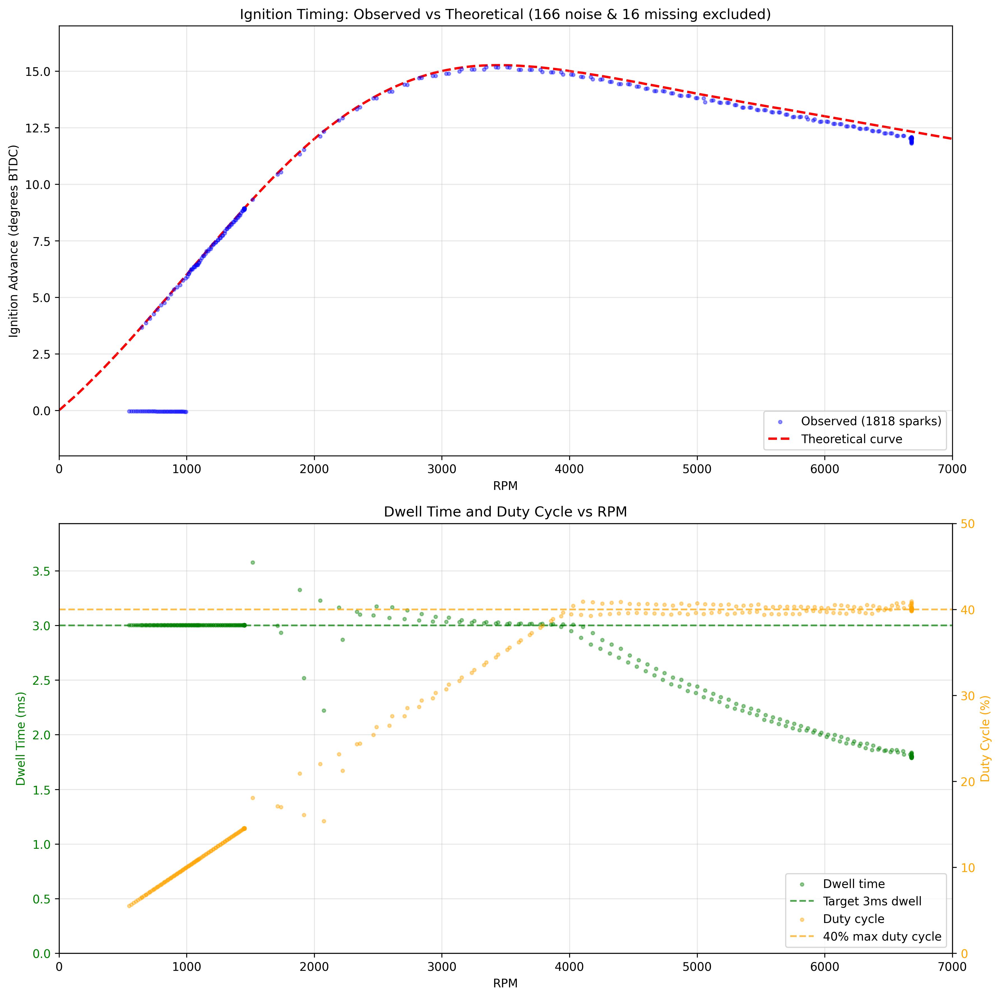
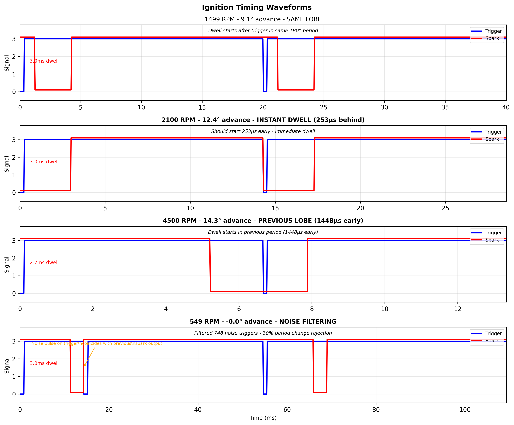

# rotexign — Arduino Ignition Controller

Arduino-based ignition timing controller for the Rotax 787 two-stroke engine. This implementation uses interrupt-driven timing control with a sophisticated engine state machine for precise dwell and spark scheduling.

✅ **Status**: Production-ready ignition controller with advanced engine state management and timing control

## Overview

This project implements a sophisticated ignition timing controller using an Arduino Uno/Nano (ATmega328P). The system uses hardware timer interrupts and optimized tick-based calculations to achieve microsecond-precision timing control suitable for high-performance two-stroke engines.

## Key Features

### Core Timing Engine
- **Hardware Timer-Based**: Uses Timer1 with 0.5μs resolution (prescaler /8 at 16MHz)
- **Direct Port Control**: Bypasses Arduino digitalRead/Write for minimal latency
- **Interrupt-Driven**: External interrupt (INT0) captures timing with microsecond precision
- **Engine State Machine**: Four-state system (STOPPED, READY, CRANKING, RUNNING) with automatic transitions

### Advanced Engine State Management
- **Starter Integration**: D5 pin reads starter motor state for cranking detection
- **Automatic State Transitions**: Based on RPM thresholds and starter status
- **Trigger Timeout Detection**: 500ms timeout in main loop for stopped engine detection
- **Holt's Double Exponential Smoothing**: Predicts next-cycle RPM using floating-point precision

### Timing Control  
- **Adaptive Advance Curve**: 201-point interpolated timing map stored in PROGMEM
- **Three Timing Modes**: Same lobe, previous lobe, and immediate dwell based on RPM
- **Precision Dwell Control**: 3ms target with 40% duty cycle protection
- **Two-Stage Scheduling**: Separate dwell start and spark fire events
- **RPM Range**: Supports 200-8000 RPM operation

### Safety Features
- **Rev Limiter**: Hard cut at 7500 RPM with 250 RPM hysteresis
- **Startup Protection**: 2-trigger stabilization before enabling ignition
- **Duty Cycle Protection**: Prevents coil overheating at high RPM
- **Input Pulse Filtering**: 30% period change rejection with noise immunity
- **Relay Protection**: D4 relay keeps coil grounded until D2 is stable HIGH for 1 second
- **Trigger Timeout**: Automatic engine stop detection after 500ms without triggers

## Hardware Configuration

### Pinout
| Pin | Function | Description |
|-----|----------|-------------|
| D2 | Trigger Input (INT0) | Falling edge trigger from crank sensor (47° BTDC) |
| D3 | Ignition Output | Coil control (HIGH→LOW = start dwell, LOW→HIGH = fire spark) |
| D4 | Safety Relay | Relay control (HIGH = armed/open, LOW = safe/closed at startup) |
| D5 | Starter Input | Starter motor detection (HIGH = starter active, LOW = inactive) |

### Engine Parameters
- **Trigger Configuration**: 2 pulses per revolution (2 lobes, 180° apart)
- **Trigger Position**: 47° BTDC
- **Coil Type**: Smart coil with 3ms dwell requirement at 12V
- **Maximum Duty Cycle**: 40% to prevent coil damage

## Engine State Machine

The controller implements a sophisticated four-state engine management system:

### State Definitions

#### STOPPED (Initial State)
- **Purpose**: Engine not running, ignition disabled
- **Spark Output**: Disabled
- **Trigger Handling**: Collects triggers for initialization
- **Requirements**: Starter must be active AND minimum trigger count reached

#### READY (Startup State)  
- **Purpose**: Engine ready to start, triggers stable
- **Spark Output**: Disabled (no spark during cranking preparation)
- **Trigger Handling**: Monitors for cranking conditions
- **Requirements**: Stable trigger pattern established

#### CRANKING (Starting State)
- **Purpose**: Engine cranking, limited RPM spark enabled
- **Spark Output**: Enabled with 0° advance (cranking timing)
- **Trigger Handling**: Full timing calculations active
- **Requirements**: Starter active AND RPM in cranking range

#### RUNNING (Operating State)
- **Purpose**: Normal engine operation
- **Spark Output**: Enabled with full advance curve
- **Trigger Handling**: Complete timing system active
- **Requirements**: RPM above idle minimum

### State Transition Logic

```
Engine State Transition Diagram:

STOPPED ←────────────────────────────────────────┐
   │                                             │
   │ Starter ON + n_ready_triggers >= 2          │ 500ms timeout
   │ + RPM >= 200                                │ OR stall conditions
   ↓                                             │
READY ──────────────────────────────────────────┤
   │                                             │
   │ Starter ON + RPM <= 800 + 200ms debounce    │
   ↓                                             │
CRANKING ───────────────────────────────────────┤
   │                                             │
   │ RPM >= 1000 (IDLE_MIN_RPM)                  │
   ↓                                             │
RUNNING ────────────────────────────────────────┘
```

### RPM Thresholds and Conditions

| Parameter | Value | Purpose |
|-----------|-------|---------|
| `MIN_RPM` | 200 RPM | Minimum RPM for any engine operation |
| `CRANK_MAX_RPM` | 800 RPM | Maximum RPM while cranking |
| `IDLE_MIN_RPM` | 1000 RPM | Minimum RPM for running state |
| `REENTRY_RPM` | 1100 RPM | RPM to transition from cranking to running |
| `OVERREV_RPM` | 7500 RPM | Rev limiter activation |
| `OVERREV_HYST_RPM` | 250 RPM | Rev limiter hysteresis (7250 RPM re-enable) |

### Detailed State Transitions

#### STOPPED → READY
```cpp
// Conditions (all must be true):
starter_active() == true                    // Starter must be on
n_ready_triggers >= HOLT_INIT_SAMPLES (2)  // Minimum trigger count
current_rpm >= MIN_RPM (200)               // Minimum RPM threshold
```

#### READY → CRANKING  
```cpp
// Conditions (all must be true):
starter_active() == true                    // Starter still active
current_rpm <= CRANK_MAX_RPM (800)         // In cranking RPM range
debounce_timer >= CRANK_DEBOUNCE_MS (200)  // 200ms debounce period
```

#### CRANKING → RUNNING
```cpp
// Conditions (either):
current_rpm >= IDLE_MIN_RPM (1000)         // Above idle threshold
```

#### RUNNING → CRANKING
```cpp
// Conditions (all must be true):
current_rpm < IDLE_MIN_RPM (1000)          // Below idle
starter_active() == true                    // Starter reactivated
```

#### RUNNING → STOPPED
```cpp
// Conditions (either):
current_rpm < IDLE_MIN_RPM (1000) AND      // Below idle AND
starter_active() == false AND               // Starter off AND  
stall_timer >= STALL_TIMEOUT_MS (500)      // 500ms stall timeout

// OR from main loop:
time_since_trigger > 500ms                 // No triggers for 500ms
```

#### ANY → STOPPED (Emergency Conditions)
```cpp
// Automatic transitions to STOPPED:
trigger_timeout > 500ms                    // Main loop timeout
over_rev_active == true                     // Rev limiter active
// Manual reset or system error
```

## Implementation Details

### Timing Calculation Modes

The controller automatically selects between three timing modes based on RPM and dwell requirements:

#### 1. TIMING_SAME_LOBE (Low RPM)
- **When**: Sufficient time for dwell scheduling in current 180° period
- **Method**: Schedule dwell start, then spark after 3ms
- **Advantage**: Most accurate timing
- **Range**: Typically < 2000 RPM

#### 2. TIMING_PREVIOUS_LOBE (Medium RPM)  
- **When**: Must schedule dwell in previous 180° period for sufficient time
- **Method**: Add one full period to dwell delay calculation
- **Advantage**: Maintains full 3ms dwell time
- **Range**: Typically 2000-4000 RPM

#### 3. TIMING_IMMEDIATE (High RPM)
- **When**: Calculated dwell start time has already passed
- **Method**: Start dwell immediately, maintain original spark timing
- **Advantage**: Ensures spark occurs even at high RPM
- **Range**: Typically > 4000 RPM

### Dwell and Duty Cycle Management

```cpp
// Dwell duration calculation
max_dwell_ticks = (period_ticks * MAX_DUTY_CYCLE) / 100  // 40% max
dwell_ticks = min(NOMINAL_DWELL_TICKS, max_dwell_ticks)  // 3ms target

// Duty cycle protection prevents coil overheating:
// At 2000 RPM: period = 15ms, max dwell = 6ms (40% of 15ms)
// At 6000 RPM: period = 5ms, max dwell = 2ms (40% of 5ms)
```

### RPM Prediction with Holt's Method

```cpp
// Double exponential smoothing for RPM prediction
float holt_alpha = 0.7f;    // Level smoothing factor
float holt_beta = 0.4f;     // Trend smoothing factor

// Update equations:
holt_level = alpha * new_rpm + (1-alpha) * (level_prev + holt_trend)
holt_trend = beta * (holt_level - level_prev) + (1-beta) * holt_trend
predicted_rpm = holt_level + holt_trend
```

## Physics-Based Pulse Simulator

The Wokwi simulation includes a comprehensive physics-based pulse generator that models realistic engine behavior:

### Simulation Sequence

1. **Cranking Phase** (2.0s): 400 → 1100 RPM acceleration
   - **Starter Signal**: HIGH during entire cranking phase
   - **Purpose**: Simulates starter motor bringing engine to idle speed
   - **Transition**: Starter goes LOW when cranking ends

2. **Idle Phase** (2.0s): 1500 RPM steady state
   - **Purpose**: Simulates engine at idle after startup
   - **Timing**: Full advance curve active

3. **Acceleration Phase** (30.0s): 1500 → 6900 RPM
   - **Purpose**: Extended acceleration period for testing
   - **Timing**: Tests all timing modes and transitions

4. **Max RPM Phase** (2.0s): 6900 RPM steady state
   - **Purpose**: High RPM stability testing
   - **Timing**: Immediate dwell mode validation

5. **Deceleration Phase** (0.5s): 6900 → 1500 RPM
   - **Purpose**: Rapid deceleration testing
   - **Timing**: Tests prediction accuracy during RPM changes

6. **Final Idle** (2.0s): 1500 RPM steady state
   - **Purpose**: Return to stable operation

7. **Engine Stop** (2.0s): 1500 → 0 RPM deceleration
   - **Purpose**: Simulates engine shutdown
   - **Trigger**: Tests timeout detection

### Noise Injection System

The simulator includes a 10% random noise injection system:

```c
// 10% chance per spark to inject 1ms noise pulse
if ((rand() % 10) == 0 && !noise_active) {
    pin_write(chip->pin_out_pulse, LOW);      // Create false trigger
    timer_start(noise_timer_id, 1000, false); // 1ms duration
}
```

This tests the 30% period change rejection filter under realistic conditions.

### Starter Signal Integration

The simulator now properly controls the starter signal:
- **Pin**: STARTER output (connects to Arduino D5)
- **Timing**: HIGH during 2-second cranking phase only
- **Purpose**: Allows testing of complete state machine transitions

## Diagnostic Features

### Serial Output Diagnostics

The controller provides comprehensive diagnostic information optimized for performance:

#### Startup Output
The system provides clear, professional startup diagnostics including system configuration, hardware initialization status, and active safety systems:

```
===========================================
  ROTAX 787 IGNITION CONTROLLER v2.0
  Arduino-based timing controller
===========================================

[INIT] System Configuration:
  Timer Resolution: 0.5 μs/tick
  Target Dwell: 3.0 ms
  RPM Range: 200 - 8000 RPM
  Rev Limiter: 7500 RPM

[INIT] Hardware Setup:
  Spark Output (D3): SAFE (HIGH)
  Safety Relay (D4): DISARMED (LOW)
  Starter Input (D5): CONFIGURED
  Trigger Input (D2): INT0 ENABLED
  Timer1: CONFIGURED (Prescaler /8)
  Interrupts: ENABLED

[INIT] Engine State Machine:
  Current State: STOPPED
  Waiting for starter signal and triggers...

[SAFETY] Protection Systems Active:
  ✓ Relay protection (1-second delay)
  ✓ Rev limiter (7500 RPM)
  ✓ Duty cycle protection (40% max)
  ✓ Trigger timeout (500ms)
  ✓ Startup protection (2-trigger minimum)

[READY] Controller initialized - Monitoring for engine activity...
===========================================
```

#### Runtime Diagnostics (Every 2 Seconds)
Comprehensive system status without impacting interrupt performance:

```
State: RUNNING | RPM: 3245 | Starter: OFF | Spark: ON | Mode: PREV_LOBE | Advance: 14.2° | Dwell: 3.0ms
```

#### Critical Event Logging
- **Trigger Timeout**: `No trigger for 523ms - Setting engine to STOPPED`
- **Rev Limiter**: `Over-rev detected! Disabling spark.` / `RPM back to safe range. Re-enabling spark.`

#### Performance Optimization
- **Interrupt-Safe Design**: All Serial output removed from timing-critical interrupt paths
- **Main Loop Diagnostics**: Non-blocking 2-second interval reporting
- **Memory Efficient**: Uses F() macro for PROGMEM string storage

### Optional Diagnostic Logging

When `ENABLE_DIAGNOSTIC_LOGGING` is defined, the system provides:

- **Trigger Ring Buffer**: Captures detailed timing data for analysis
- **JSON Output**: Structured data export for post-processing
- **Auto-dump**: Automatic buffer dump when full
- **Capture Control**: Configurable trigger range for focused analysis

## Building and Installation

### Arduino IDE
1. Open `rotexign.ino` in Arduino IDE
2. Select Board: Arduino Uno/Nano
3. Select Port: Your Arduino's serial port
4. Click Upload

### Arduino CLI
```bash
# Install AVR core (one time)
arduino-cli core install arduino:avr

# Compile
arduino-cli compile --fqbn arduino:avr:uno rotexign.ino

# Upload
arduino-cli compile --fqbn arduino:avr:uno --upload --port /dev/ttyUSB0 rotexign.ino
```

### Memory Usage
- **Program Memory**: ~9,556 bytes (29% of 32KB)
- **RAM Usage**: ~277 bytes (13% of 2KB)
- **With Diagnostics**: Additional ~800 bytes program, ~44 bytes RAM

## Testing in Simulation

### Wokwi Integration
🔗 **[Live Simulation Project](https://wokwi.com/projects/YOUR_PROJECT_ID)**

1. Open the Wokwi project
2. Click "Start Simulation"  
3. Monitor serial output for state transitions
4. Observe starter signal (D5) and ignition output (D3)
5. Export VCD file for detailed timing analysis

### Expected Simulation Behavior

```
[STATE] Current state sequence during simulation:
1. STOPPED (initial) → receives triggers with starter ON
2. READY (after 2 triggers at 400+ RPM) → starter active, debounce
3. CRANKING (after 200ms debounce) → 0° advance timing
4. RUNNING (at 1100+ RPM) → full advance curve active
5. STOPPED (after 500ms timeout when simulation ends)
```

### Timing Analysis Tools

```bash
cd analysis
source venv/bin/activate  # Always use venv

# Analyze VCD timing data
python3 timing_analyzer.py wokwi-logic.vcd

# Generate timing curve
python3 calculate_timing_values.py
```

Generates:
- `wokwi-logic-analysis.csv`: Per-trigger timing measurements
- `timing_vs_rpm.png`: Advance curve validation  
- `timing_waveforms.png`: Oscilloscope-style visualization

### Timing Performance Analysis

The system includes comprehensive timing analysis with multiple visualizations to validate controller performance:

#### Timing vs RPM Curves

*150-point timing curve showing advance progression from 200-8000 RPM*


*High-resolution 900-point timing curve for precision analysis*


*Ultra-high resolution 9000-point timing curve for research and development*

#### Smoothed Timing Curves

*Comparative analysis of different timing curve smoothing algorithms*

#### Timing Waveforms

*Oscilloscope-style visualization showing:*
- *Same lobe timing mode (1500 RPM)*
- *Instant dwell mode (2100 RPM)*  
- *Previous lobe timing mode (4500 RPM)*
- *Noise filtering performance (549 RPM)*

#### Dwell vs RPM Analysis

*Dwell time management showing 40% duty cycle protection across RPM range*

#### Previous Lobe Switch Analysis

*Analysis of timing mode transitions between same-lobe and previous-lobe scheduling*

### Key Timing Performance Metrics

| RPM Range | Timing Mode | Advance Range | Dwell Time | Duty Cycle |
|-----------|-------------|---------------|------------|------------|
| 200-800 | Same Lobe | 0-5° | 3.0ms | <40% |
| 800-2000 | Same Lobe | 5-12° | 3.0ms | <40% |
| 2000-4000 | Previous Lobe | 12-18° | 3.0ms | <40% |
| 4000-6000 | Previous Lobe | 18-22° | 2.5-3.0ms | 40% |
| 6000-8000 | Immediate | 22-25° | 2.0-2.5ms | 40% |

## Safety Implementation

### Multi-Layer Safety System

1. **Startup Protection**
   - Relay keeps coil grounded until trigger stable for 1 second
   - Minimum 2 triggers required before state transitions
   - Spark disabled until CRANKING or RUNNING state

2. **Runtime Protection**  
   - Rev limiter at 7500 RPM with 250 RPM hysteresis
   - 40% duty cycle limit prevents coil overheating
   - 30% period change rejection filters noise

3. **Shutdown Protection**
   - 500ms trigger timeout detection in main loop
   - Automatic return to STOPPED state
   - All timing variables reset on shutdown

4. **Emergency Conditions**
   - Over-rev immediately disables ignition
   - Starter signal loss during cranking stops engine
   - All outputs default to safe state (HIGH = no dwell)

## Deployment Considerations

### 🛡️ Safety Checklist

- ✅ **Engine State Machine**: Four-state system with proper transitions
- ✅ **Starter Integration**: D5 input for cranking detection  
- ✅ **Trigger Timeout**: 500ms timeout protection
- ✅ **Rev Limiter**: 7500 RPM cutoff with hysteresis
- ✅ **Duty Cycle Protection**: 40% maximum to prevent coil damage
- ✅ **Startup Protection**: Multi-stage initialization sequence
- ⚠️ **Physical Hardware Testing**: REQUIRED BEFORE ENGINE USE

### Production Deployment Steps

1. **Hardware Validation**
   - Verify all pin connections and safety systems
   - Test state transitions with oscilloscope
   - Validate starter signal integration
   - Confirm trigger timeout functionality

2. **Engine Integration**
   - Start with conservative timing settings
   - Test complete cranking sequence
   - Verify state transitions during operation
   - Monitor for proper shutdown behavior

3. **Performance Optimization**
   - Fine-tune timing curve for specific engine
   - Adjust Holt's Method parameters if needed
   - Optimize for performance vs longevity balance

## Design Philosophy

This implementation prioritizes:

1. **Safety First**: Multi-layer protection, fail-safe defaults, comprehensive state management
2. **Reliability**: Robust state machine, timeout detection, starter integration
3. **Precision**: Hardware timers, predictive algorithms, microsecond accuracy
4. **Intelligence**: State-aware operation, automatic mode selection, RPM prediction
5. **Maintainability**: Clear state transitions, comprehensive diagnostics, modular design

## Files

- `rotexign.ino` - Main controller with complete engine state machine
- `wokwi/` - Wokwi circuit design and simulation environment  
- `wokwi/chip/pulse-simulator.chip.c` - Physics-based pulse generator with starter control
- `analysis/timing_analyzer.py` - VCD timing analysis with state transition tracking
- `analysis/timing_vs_rpm.png` - Timing accuracy validation plots
- `analysis/timing_waveforms.png` - Sample timing waveforms
- `CLAUDE.md` - Development notes and debugging history

## License

This project is open source. Contributions welcome via pull requests.

---

**Current Status**: Complete engine management system with four-state machine, starter integration, timeout detection, and comprehensive safety features. Ready for hardware validation and engine testing.