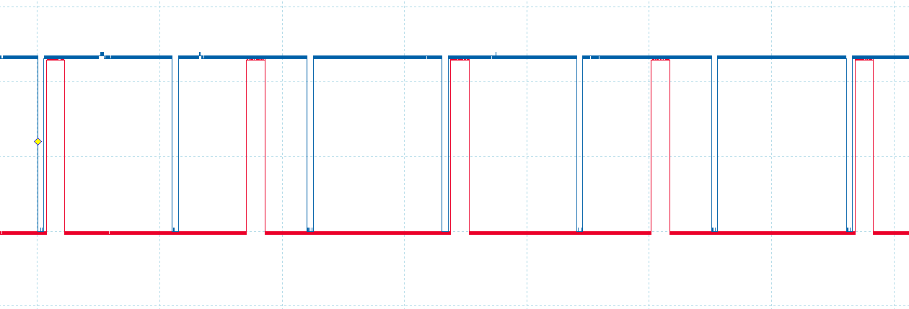
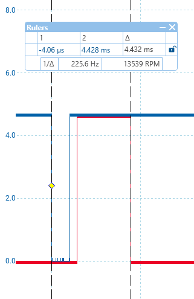

# Jetski Firmware Testing Results

This document provides a detailed transcription and clarification of the testing results described in the email exchange. All personal identifiers have been removed. The results are linked to the provided test images for clarity.

---

## Test Procedure and Observations

### Input Signal (Blue Trace)

* The **blue trace** represents the input signal provided by another Arduino Nano.
* Signal characteristics:

  * 22 ms between the falling edge and a subsequent 1 ms low pulse.
* The Arduino serial monitor reported the following values:

  * **RPM:** 1359
  * **Period:** 22042 μs
  * **Advance:** 10.79°
  * **Engine:** ON
  * **Errors:** 0x0
* These values confirm that input measurement and calculation are functioning correctly.

---

### Primary Spark Output (Red Trace, Pin D9)

* **Startup behavior:**

  * On power-up with no input pulses, Pin D9 is set to 5V.
  * This behavior is correct because it drives the optocoupler and grounds the coil output.

* **With input applied to Pin D2:**

  * Output on Pin D9 appears **inverted** compared to expectations.
  * For proper coil operation, the output should be low to provide 5V to the coil.

* **Observed waveform pattern:**

  * The red trace shows a repeating pattern of three pulses, each shifted to the right.
  * The first pulse in this repeating sequence aligns with the correct ignition timing, but is inverted.
  * Measurement of this delay:

    * **4.428 ms** after the falling edge of the blue trace.
    * Equivalent to approximately **11° Before Top Dead Center (BTDC)**.
    * Dwell period measured at **3 ms**.

---

### Pin 10 Output

* No visible output was detected on Pin 10 during the test.
* Its intended function remains undefined and requires clarification.

---

## Key Findings

1. **Input signal decoding** is correct, producing accurate RPM and timing calculations.
2. **Primary spark output (D9)** shows two issues:

   * Inverted polarity relative to expectations.
   * Repeating 3-pulse pattern with only the first pulse aligning correctly.
3. **Pin 10 output** shows no activity and requires clarification of its role.

---

## Next Steps

* Correct the output polarity on Pin D9.
* Investigate and resolve the repeating 3-pulse output behavior.
* Define and validate the function of Pin 10.
* Re-run timing validation to ensure proper ignition behavior across operating RPM ranges.

---
