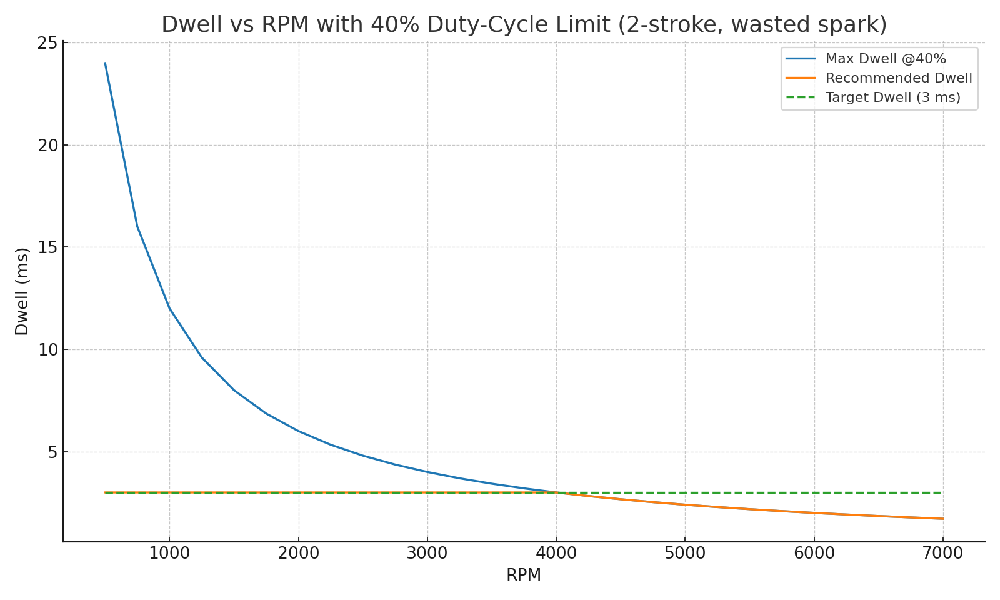
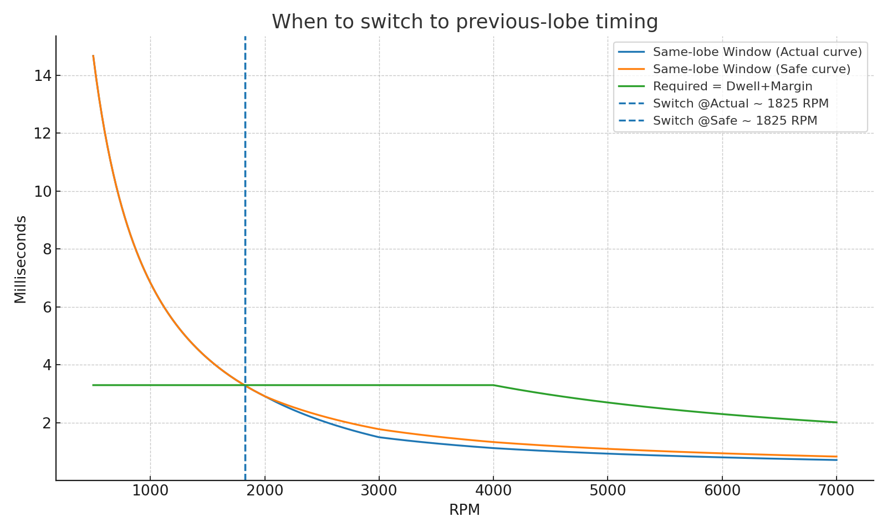

# Ignition Coil Control and Timing Design Notes

## 1. Introduction
This document consolidates the design notes, theoretical background, calculations, and simulation results for the ignition system project. The goal is to provide a coherent description of the physical principles, terminology, constraints, and derived design rules, including the role of dwell time, duty cycle, and the transition to previous-lobe timing.

## 2. Key Terms and Theory

### 2.1 Ignition Coil Operation
- The ignition coil stores energy when current flows through its primary winding. This charging period is called the **dwell time**.
- The coil fires (discharges) when the input pulse goes low, creating a high-voltage spark on the secondary side.

### 2.2 Dwell Time
- **Dwell time** is the duration of the pulse that keeps the coil energized (charging).
- Example: If the Arduino drives a 5 V pulse of 3 ms duration, then the dwell time is 3 ms.

### 2.3 Duty Cycle
- The **duty cycle** is the ratio of the dwell time to the total period between successive sparks:
  
  
  $$\text{Duty Cycle (\%)} = \frac{\text{Dwell Time}}{\text{Period per spark}} \times 100$$
  

- **Constraint**: The coil has a maximum continuous duty cycle of 40% to prevent overheating.

### 2.4 Engine and Spark Events
- Engine: **Rotax 787**, 2-cylinder, 2-stroke.
- One coil, wasted-spark system: the coil fires once per cylinder per revolution → **two sparks per revolution**.
- Period per spark event:
  
  $$T_{\text{spark}} = \frac{30000}{\text{RPM}} \; \text{ms}$$
  

### 2.5 Trigger and Advance Angles
- The trigger point occurs **47° before TDC** of the piston.
- Ignition advance curve determines how many degrees before TDC the spark occurs.
- Window available for dwell when using the same lobe:
  
  $$t_{\text{window}} = \frac{(47^\circ - \text{advance})}{360^\circ} \cdot \frac{60000}{\text{RPM}}$$
  
- If $t_{\text{window}} < t_{\text{dwell}}$, then previous-lobe timing must be used.

## 3. Coil Constraints from Manufacturer
- Maximum continuous duty cycle: **40%**
- Maximum dwell at 14 V: **9 ms**
- Recommended dwell at 12 V: **~3 ms**

The software must **never leave the output high continuously**, otherwise the coil burns out.

## 4. Duty Cycle and Safe Dwell vs RPM
At low RPM the dwell can be kept near 3 ms, but as RPM rises the period per spark shrinks, forcing the duty cycle up. Above ~4000 RPM, a fixed 3 ms dwell exceeds the 40% duty cap.

### Safe Dwell vs RPM Plot

*Figure: Safe dwell time as a function of RPM, constrained by the 40% duty cycle limit.*

- \<=4000 RPM: 3 ms dwell is within the 40% duty cap.
- \>4000 RPM: dwell must reduce with RPM to respect the cap.

Full table: see [safe_dwell_vs_rpm.csv](safe_dwell_vs_rpm.csv).

## 5. Transition to Previous-Lobe Timing

### 5.1 Why Needed
- With same-lobe timing, dwell can only begin at the trigger point.
- At higher RPM, the available window between trigger and spark (based on advance angle) becomes too short for the required dwell.
- Using the **previous lobe** adds ~180° of crank rotation lead time, which is:
  
  $$\Delta t = \frac{30000}{\text{RPM}} \; \text{ms}$$
  
- At 7000 RPM this gives ~4.3 ms of additional margin, allowing safe dwell.

### 5.2 Analysis
- Using both the "Actual" and "Safe" timing curves from the notes, the same-lobe window becomes insufficient at **~1825 RPM** (when dwell+margin no longer fits).
- Above this point, previous-lobe timing must be used.

### Switch Analysis Plot

Full table: see [previous_lobe_switch_points.csv](previous_lobe_switch_points.csv).

## 6. Practical Design Rules
1. Cap dwell time at the **minimum** of:
   - 3 ms target (at 12 V)
   - 40% duty-cycle limit (varies with RPM)
   - Absolute maximum 9 ms
2. Use **same-lobe timing** up to ~1800 RPM, then switch to **previous-lobe timing**.
3. Ensure software never leaves the output high; outputs must be grounded safely during startup.
4. Noise filtering is required (reject pulses shorter than expected duration).

## 7. Conclusion
- The design must balance coil heating limits, available timing windows, and the engine’s required advance.
- Duty cycle and dwell are central: **too much dwell → coil overheats**, **too little dwell → weak spark**.
- Previous-lobe timing is essential above ~2000 RPM to guarantee reliable dwell windows.

---
**Generated Design Report**  
Consolidated from experimental notes, calculations, and simulation outputs.
